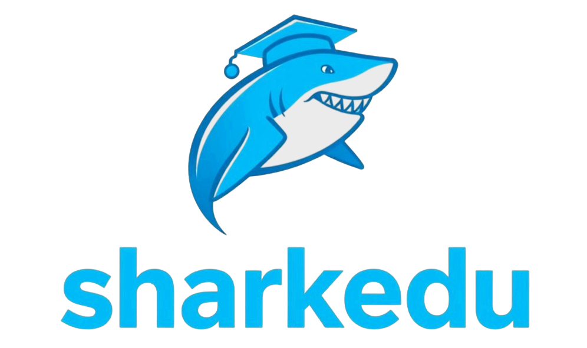

## Project Overview

Sharkedu is an AI-powered educational platform designed to enhance learning experiences through interactive and engaging content. Developed during [TartanHacks](https://tartanhacks.com/) 2025, our project aims to provide students with a clever way to learn complex subjects through automation, gamification, and real-time feedback.

## Demo


## Features

- **PDF Flashcard and Image Extraction**: Automatically extract key concepts and images from PDF documents (e.g. lecture slides) to create flashcards.
- **Learner Oversight**: Edit flashcards and add citations from slides to ensure accuracy and credibility.
- **Gamification**: Test your knowledge using interactive flashcards with various question formats.
- **AI-powered learning**: Incorporates tailored information by perplexity

## Technologies

- **Frontend**: React.js, Next.js
- **Backend**: Node.js, Python, Cloudflare Pages
- **Database**: Firestore
- **APIs**: Perplexity
- **Deployment**: Docker

## Installation

1. Clone the repository:
    ```bash
    git clone https://github.com/yourusername/Sharkedu.git
    ```
2. Navigate to the project directory:
    ```bash
    cd Sharkedu
    ```
3. Install dependencies:
    ```bash
    npm install
    ```
4. Start the development server:
    ```bash
    npm start
    ```

## Acknowledgements

We would like to thank ScottyLabs for organizing [TartanHacks](https://tartanhacks.com/), and providing this amazing opportunity!
